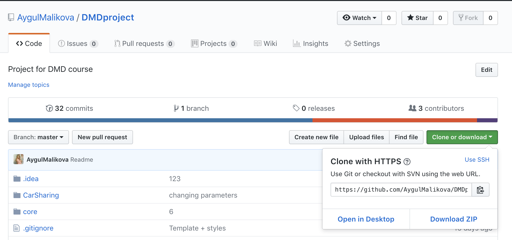
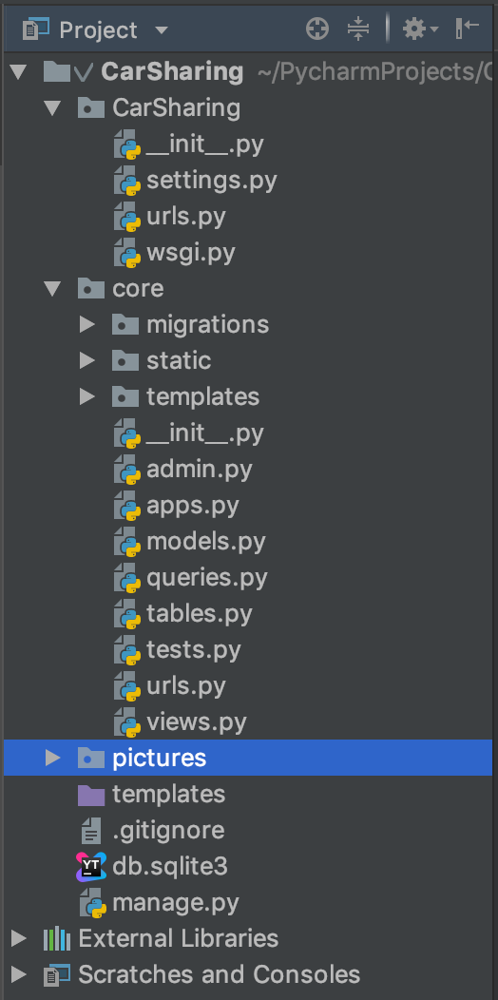
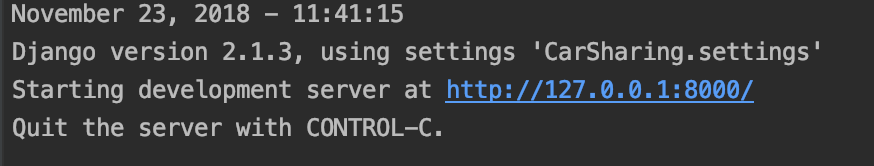
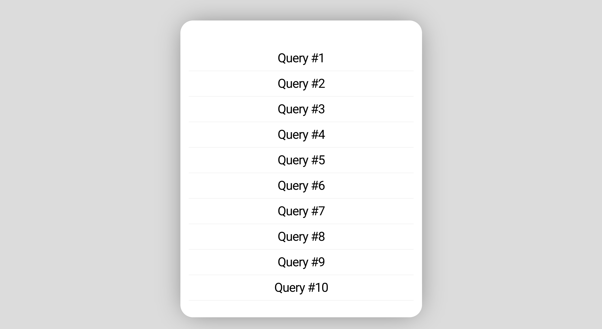

### DMDproject

Car Sharing Project for DMD course 

Done by:

<a href="https://github.com/AygulMalikova">Malikova Aygul</a>

<a href="https://github.com/Mirlan-code">Mullanurov Almir </a>

<a href="https://github.com/plohoicod">Polivtsev Egor</a>


Course: BS17-06, Bachelor

TA: Subham Chakraborty

Innopolis University
2018

---
### Contents
+ <a href="#stack">Stack of used technologies</a>
+ <a href="#install">How to install</a>
+ <a href="#usage">How to use</a>
+ <a href="#more">More</a>

<a name="stack">

## Stack of used technologies
</a>

In order to create a convenient and understandable interface with the user, was decided to make a web-application using the following technologies:
+ HTML 5
+ CSS 3

Backend:
+ Django 2.1.3
+ Python 3.7

Database: 
+sqlite3

<a name="stack">

## How to install
</a>

1. Download project on your computer

 

2. Open in editor that supports python3 and django
(We Use PyCharm)

3. Сheck for compatibility of versions used in the project
(See <a href="#stack">here</a>)

4. Project should has this structure: 

 
 
5. Open ternimal and run

```
  pip3 install django_tables2
  pip3 install GeoIP2
```
  
6. After it 

```
python3 ./manage.py migrate  
```
7. Finally

```
python3 manage.py runserver
```

8. If everything is alright you we get:

 
 
9. Click the link and it will open page in your browser

 

